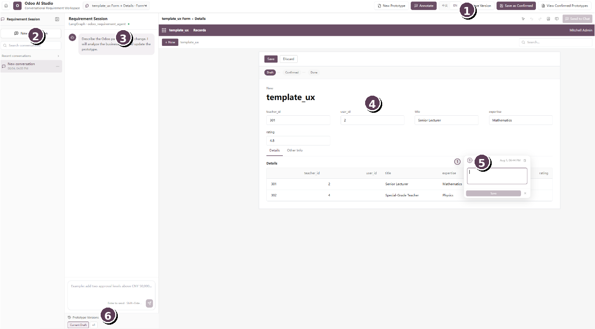

# Introduction

Odoo AI Studio is a collaborative requirement-definition workspace for Odoo customization projects. It converts an Excel-based data structure into an interactive Odoo-style prototype, lets business users modify the prototype through natural-language chat, and allows precise requirements to be attached directly to fields, tables, buttons, tabs, and other interface elements. The resulting context can then be transformed into a structured development specification for implementation and review.

## Intended users

- Business users and process owners who need to describe desired Odoo changes without writing code.
- Odoo consultants and business analysts who collect, clarify, and confirm requirements.
- Developers who need precise information about affected views, fields, behaviors, and acceptance criteria.

## Core capabilities

| **Capability**               | **What it provides**                                                                                                |
|------------------------------|---------------------------------------------------------------------------------------------------------------------|
| Excel-to-UI generation       | Builds an Odoo-style prototype from tables, fields, sample records, and relationships defined in an Excel workbook. |
| Conversational editing       | Changes the visible prototype from plain-language instructions entered in the requirement chat.                     |
| Contextual annotation        | Pins numbered comments to exact interface locations so the intended change is visually unambiguous.                 |
| Specification generation     | Converts the prototype, conversation, and annotations into structured customization requirements.                   |
| Version and approval control | Saves iterations, preserves the current draft, and records a confirmed prototype as the approved baseline.          |

> **Important:** The generated specification should be reviewed by an Odoo functional consultant or developer before implementation. Unless a separate deployment integration is enabled, confirming a prototype does not directly change a production Odoo database.

